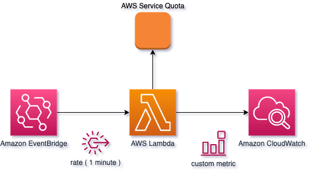

# Quota Catcher

  

Deploys an AWS Lambda function to query the Quotas Service for quotas which are not currently natively supported by 
Amazon CloudWatch. This function is then scheduled to run every minute using Amazon EventBridge.